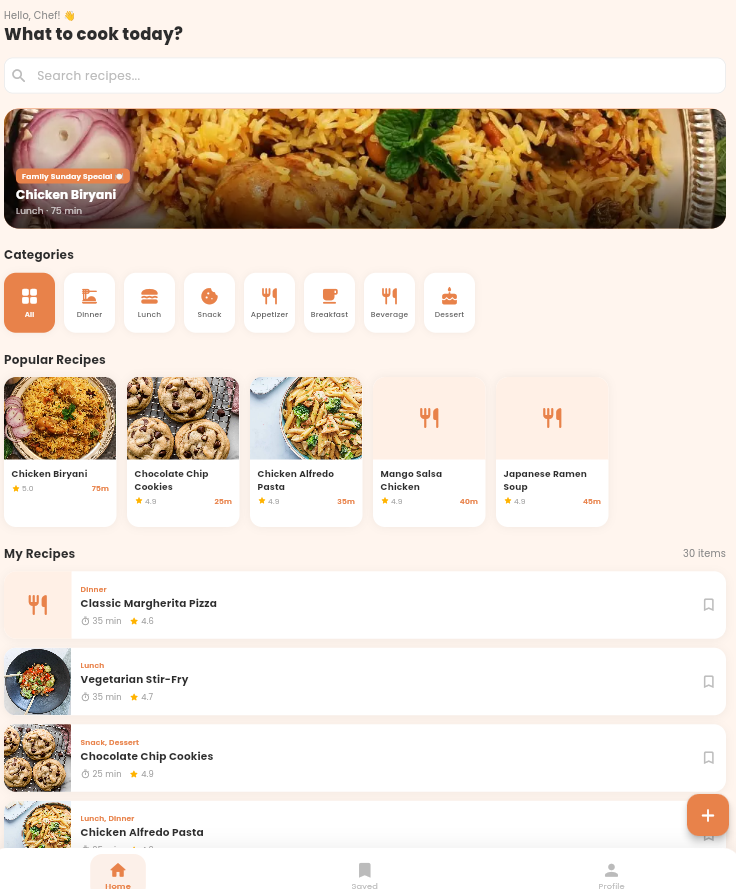
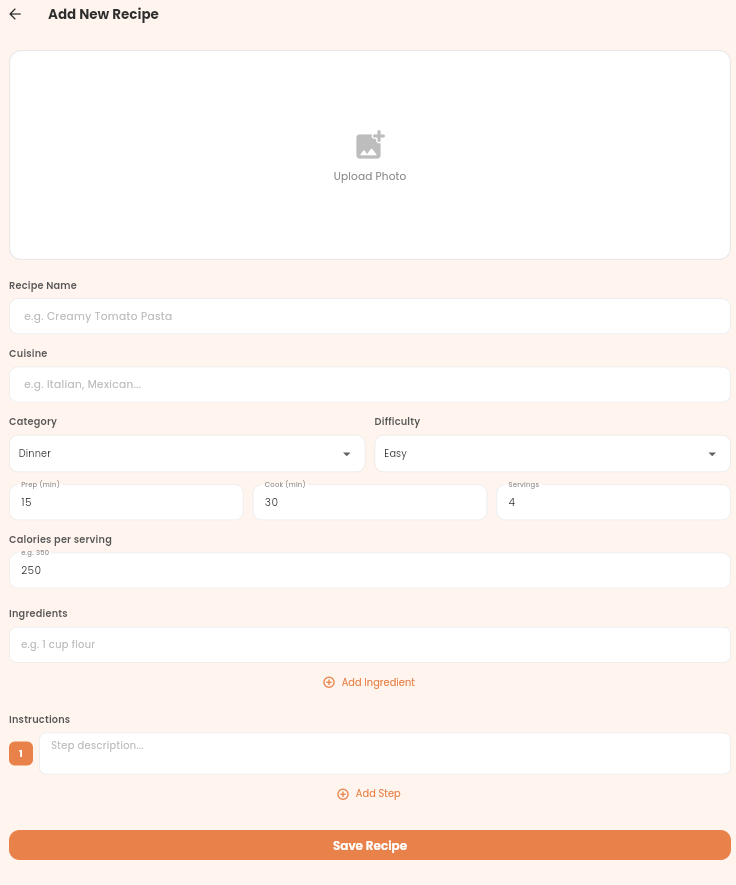
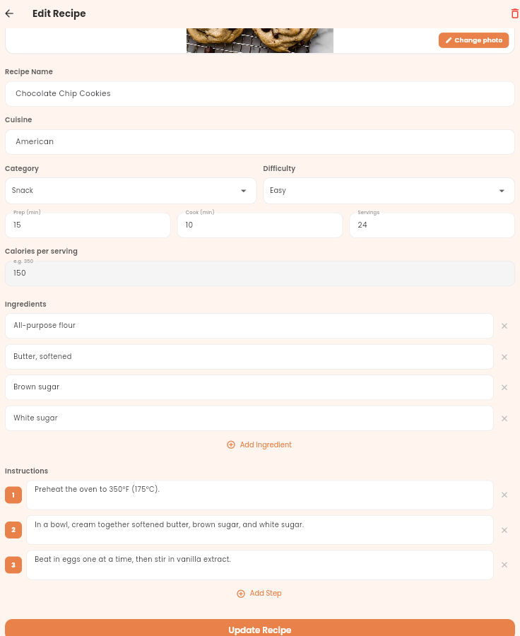
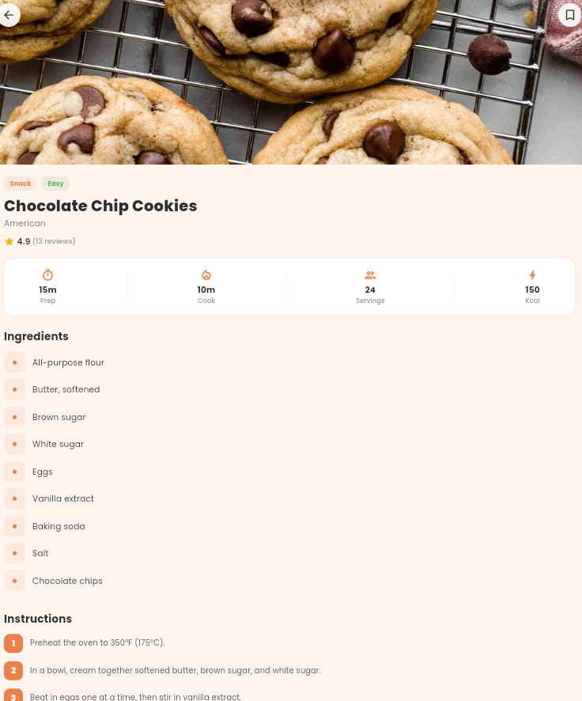
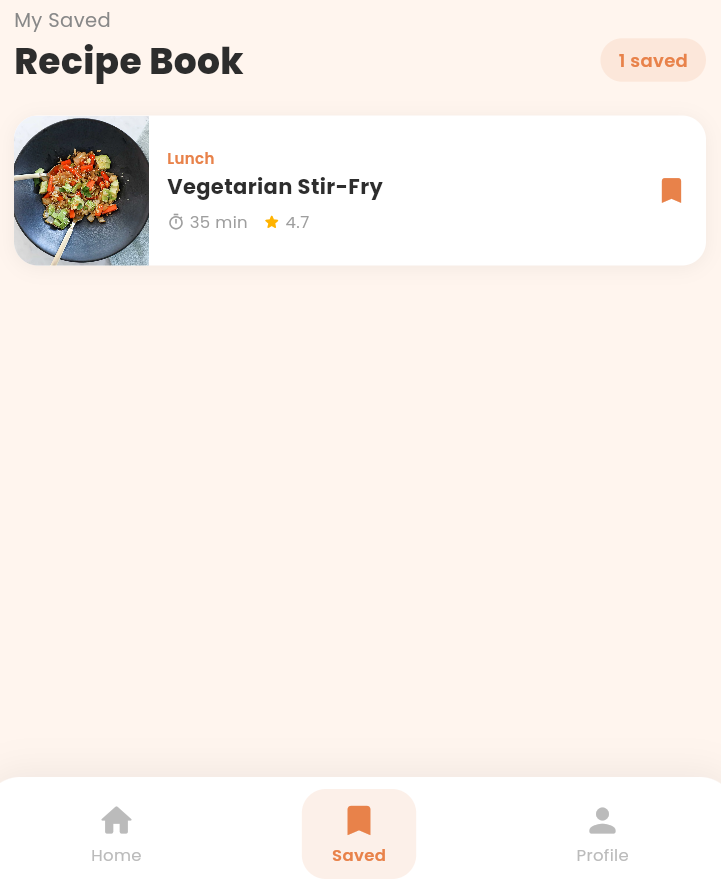
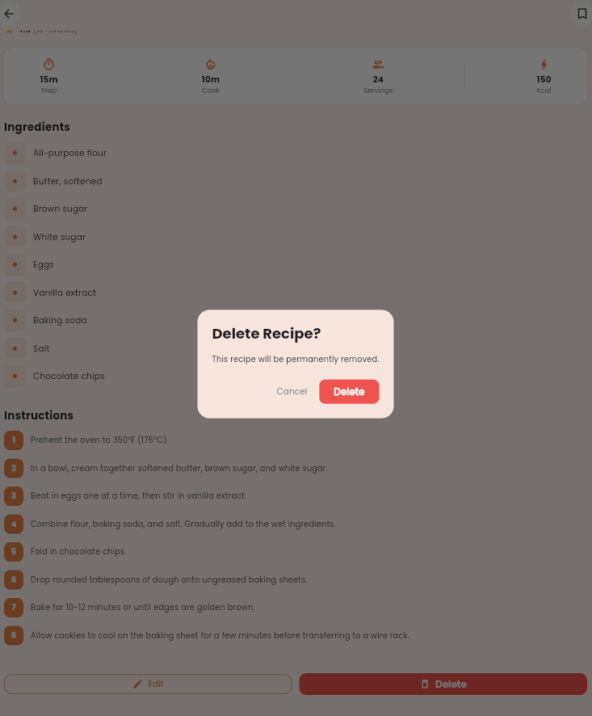

# CRUD_API_provider
# Home Kitchen Recipe Book

## Project Description

Home Kitchen Recipe Book is a Flutter Recipe Manager application developed for Assignment 1.

The application demonstrates full CRUD (Create, Read, Update, Delete) functionality using:

- **Provider** for state management
- **HTTP package** for network requests
- **Material 3** for UI design

It allows users to browse, create, edit, delete, and save recipes while handling loading and error states properly.

---

## Features

### Recipe Management
- Add new recipes
- View all recipes
- Edit existing recipes
- Delete recipes

### Search and Categories
- Search recipes by name
- Browse recipes by category

### Saved Recipes
- Save favorite recipes
- View saved recipes on a separate screen

### Profile Page
- View user profile information

### Loading and Error Handling
- Loading indicators while fetching data
- Error messages with retry functionality

---

## Technologies Used

- Flutter
- Provider
- HTTP package
- Material 3
- Google Fonts

---

## Project Structure

```text
lib/
├── core/
│   └── constants/
│       └── api_constants.dart
│
├── features/
│       ├── data/
│       │   ├── datasources/
│       │   ├── models/
│       │   └── repositories/
│       │
│       └── presentation/
│           ├── providers/
│           └── screens/
│
└── main.dart
```

---

## CRUD Implementation

### Create
Users can add new recipes through the Add Recipe screen.

### Read
Recipes are fetched from the API and displayed on the home screen.

### Update
Recipes can be edited and changes are reflected immediately in the UI.

### Delete
Recipes can be removed from the list with confirmation.

---

## Provider State Flow

UI  
→ RecipeProvider  
→ RecipeRepository  
→ RecipeRemoteDatasource  
→ HTTP API  
→ UI Update

---

## API Used

This project uses the **DummyJSON Recipes API**.

Base URL:

```text
https://dummyjson.com
```

Endpoints used:

- GET `/recipes`
- POST `/recipes/add`
- PUT `/recipes/{id}`
- DELETE `/recipes/{id}`

---

## Setup Instructions

### Install dependencies

```bash
flutter pub get
```

### Run the application

```bash
flutter run
```

### Run static analysis

```bash
flutter analyze
```

---

## Screenshots

### Splash Screen


### Home Screen


### Add Recipe Screen


### Edit Recipe Screen


### Detail Screen


### Saved Screen


### Profile Screen

### delete screen


---

## Assignment Requirements Checklist

- [x] Flutter application
- [x] CRUD operations
- [x] Provider state management
- [x] HTTP package for network requests
- [x] Clean project structure
- [x] Loading states
- [x] Error handling
- [x] README documentation
- [x] Screenshots included

---

## Notes

The application updates local state immediately after editing, creating, or deleting recipes to ensure that changes are visible without requiring manual refresh.
